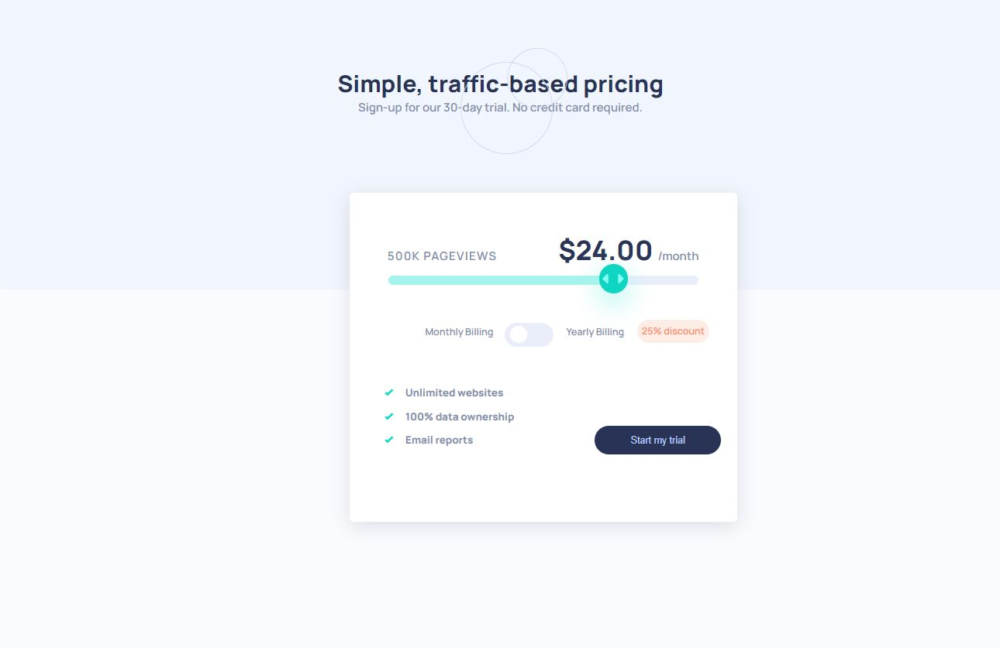
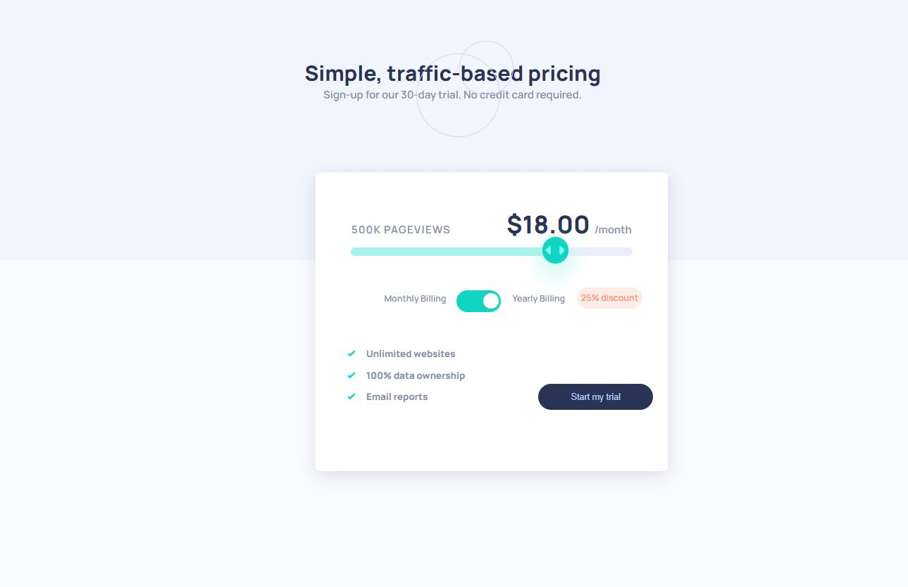

# Frontend Mentor - Interactive pricing component solution

This is a solution to the [Interactive pricing component challenge on Frontend Mentor](https://www.frontendmentor.io/challenges/interactive-pricing-component-t0m8PIyY8). Frontend Mentor challenges help you improve your coding skills by building realistic projects. 

## Table of contents

- [Overview](#overview)
  - [The challenge](#the-challenge)
  - [Screenshot](#screenshot)
  - [Links](#links)
- [My process](#my-process)
  - [Built with](#built-with)
  - [What I learned](#what-i-learned)
  - [Continued development](#continued-development)
  - [Useful resources](#useful-resources)


**Note: Delete this note and update the table of contents based on what sections you keep.**

## Overview

### The challenge

Users should be able to:

- View the optimal layout for the app depending on their device's screen size
- See hover states for all interactive elements on the page
- Use the slider and toggle to see prices for different page view numbers

### Screenshot





### Links

- Solution URL: [solution](https://github.com/hayaahmed/interactive-pricing-component-main)
- Live Site URL: [ live site URL](https://hayaahmed.github.io/interactive-pricing-component-main)

## My process

### Built with

- Semantic HTML5 markup
- CSS custom properties
- Flexbox
- CSS Grid
- [vue](https://vuejs.org/) - JS library

### What I learned
- change background size of input range due to the event of input onchange 
```js
  changewidth(event) {
          this.pricing();
          event.target.style.backgroundSize = `${((this.thevalue) * 20) + 10}%`;
        }
```